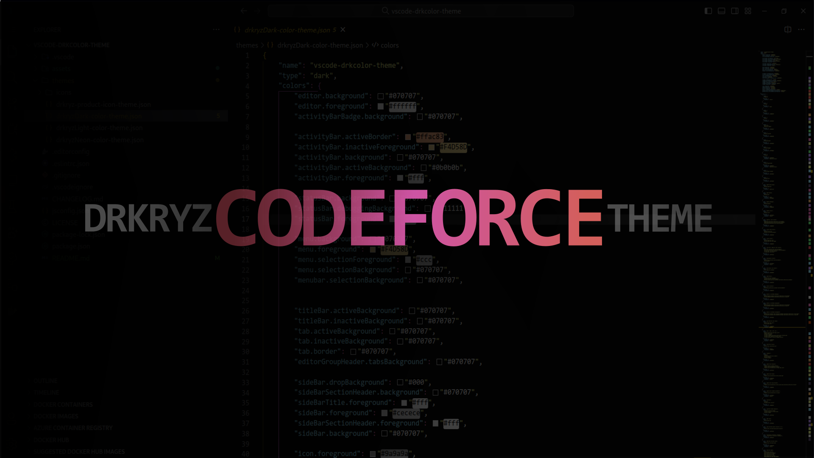

# Hi Darker!
Looking for a simple theme to use in your environment?  
***Maybe you will like this theme that was made taking a little bit of each existing theme, strengths and weaknesses, but it is still not a fully sufficient theme to please our eyes for a long time!***

***I made this theme little by little, seeing which colors would be most pleasing to the eye, and the editor's background was the hardest to find, as I wanted one that would best fit any desktop***

# Themes

| Theme              | color  | status         |
|--------------------|--------|----------------| 
| Drkryz Dark Theme  | Dark   | updated/master |
| Drkryz Neon Theme  | Dark   | old/recent     |
| Drkryz Light Theme | Light  | old            |

 You can suggest new themes or also suggest new colors for the current ones.
    

# Let's code?

  

# Do you like these colors?

  

# Do you like these buttons?

  

## You can contribute the colors too!
