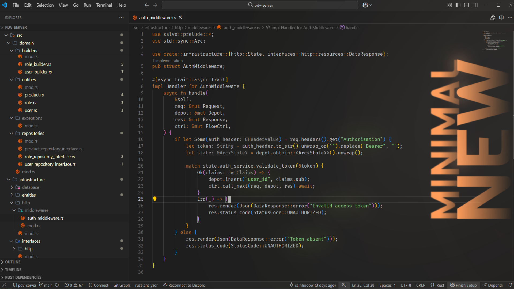

# Drkryz Theme

The Drkryz theme came about as a new color scheme, where everything was very colorful, fun, and the like, where a creator was inspired by beautiful things, not productive ones. In my constant pursuit of improving the theme and trying to fit all the colors so that everything would be comfortable, I may have returned to the bare minimum of the development environment: nothing.

I'm restarting the theme from scratch, based on just a few minimalist colors, searching the internet for what might be comfortable for each user. Version 1.50.0 is the new absolute zero of the drkryz theme, a new proposal.

Drkryz theme is a Visual Studio Code theme built around a simple idea:  
**clean, soft colors that help you stay focused on what really matters — your work.**

This theme started as a personal project, inspired by my own taste for calm and minimal color palettes. But it didn’t stop there. Over time, I’ve refined it based on the feedback and preferences of other developers who share the same need: a coding environment that feels comfortable, distraction-free, and built for long sessions of productivity.

## ✨ Why this theme?
  
- Gentle, carefully chosen colors that are easy on the eyes  

   

- Clean contrasts that improve readability without overwhelming you  
- A design that supports focus, instead of stealing it  

## 🚀 Getting Started

1. Open **Visual Studio Code**  
2. Go to the **Extensions** panel (`Ctrl+Shift+X` / `Cmd+Shift+X`)  
3. Search for **Minimal smooth theme**  
4. Install and activate the theme  

That’s it — your editor should now feel lighter, calmer, and ready for deep focus.

## 💡 Contribute

This theme grows with its users. If you have ideas, color tweaks, or suggestions, feel free to open an issue or share your thoughts. Your input directly shapes how this theme evolves.
