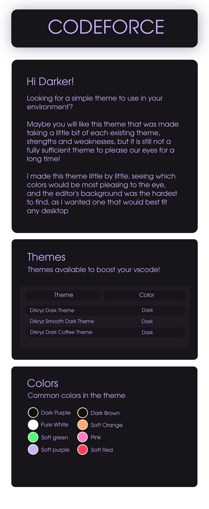
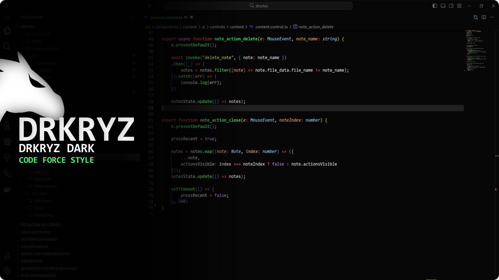
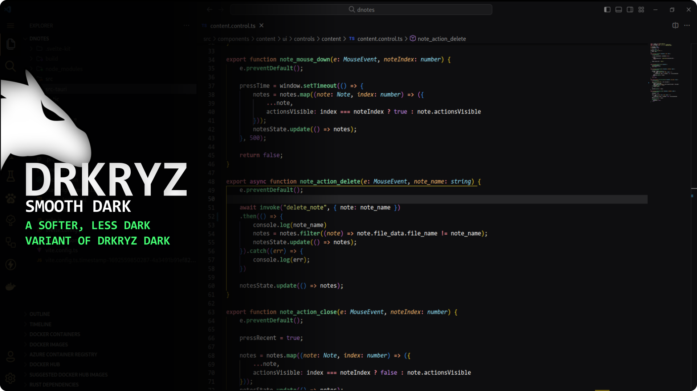
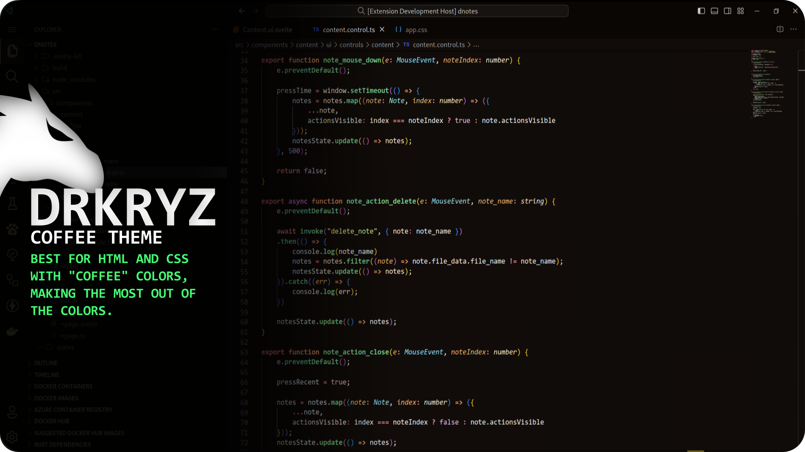
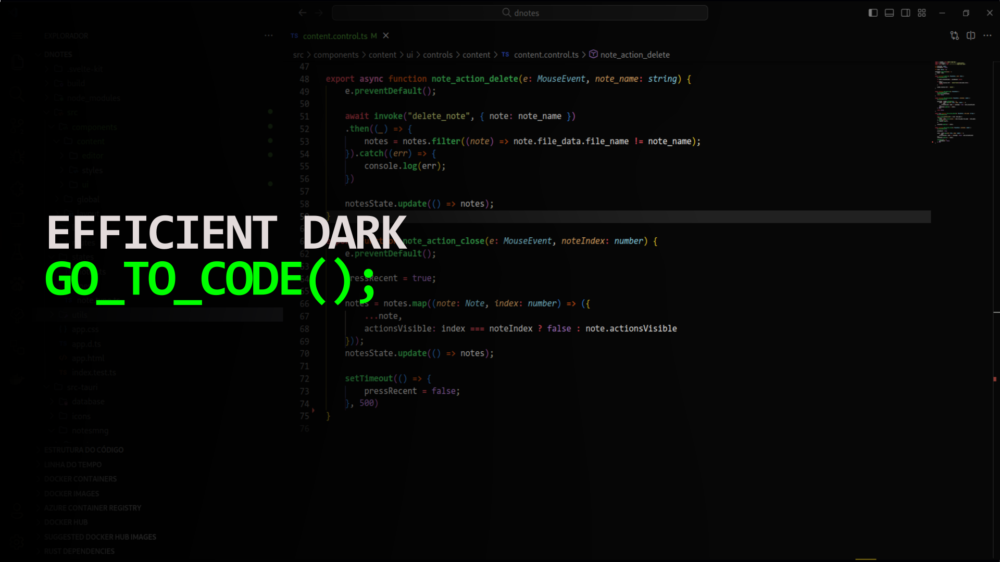
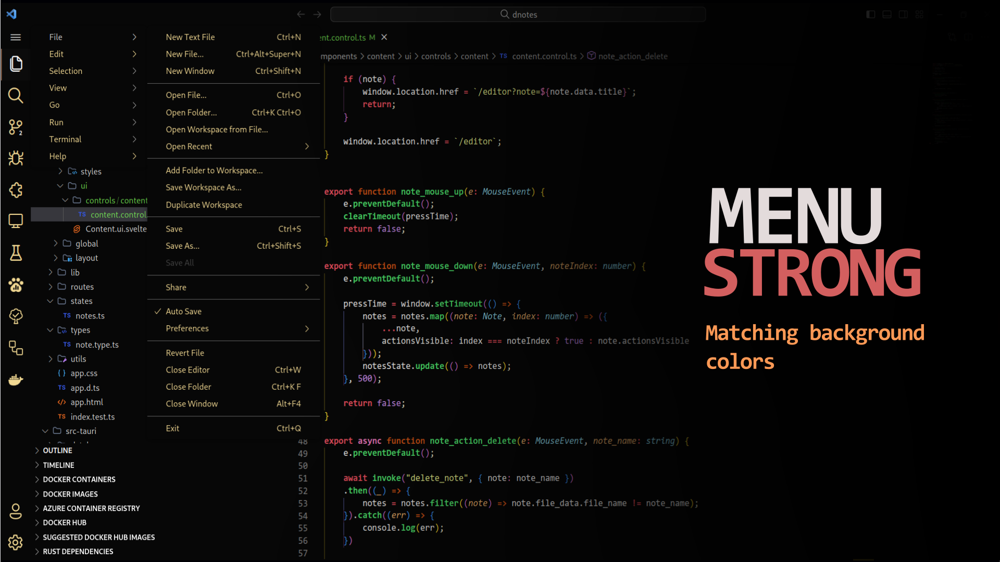
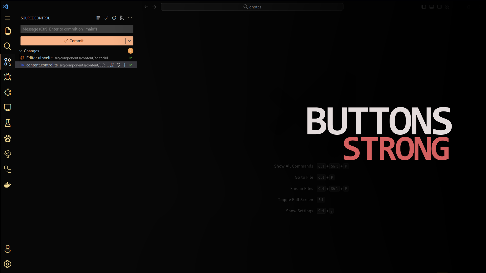
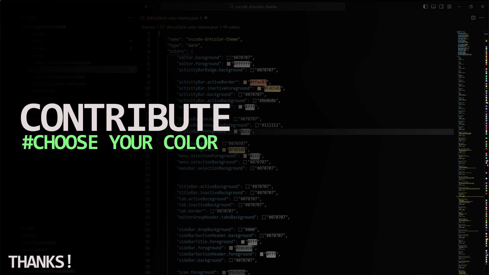

# Recommended to use together

- Fluent Icons - (Editor Icons)
- Symbols - (Editor Icons)
- Toggle Bracket Guides - (Editor highlighted brackets)
- Better Comments - (Editor comments)

# Let's code?

**You can create a new pattern to decorate functions in your code, or differentiate keywords through colors.**  
**This is not exclusive to our theme!**
  

# Do you like these colors?

**This theme does not have colored borders, the background of all the menus fits together and what sets them apart is their default shadow.**  
**I did this to try and fit the look of the editor in any desktop environment**
  

# Do you like these buttons?

**The theme has a color palette, so I tried to fit all the colors into a single pattern, making a combination of several strong colors.**
  

## You can contribute the colors too!

**The theme is not mine alone, and from me to the community that seeks comfort at work, and you can contribute to it!**
